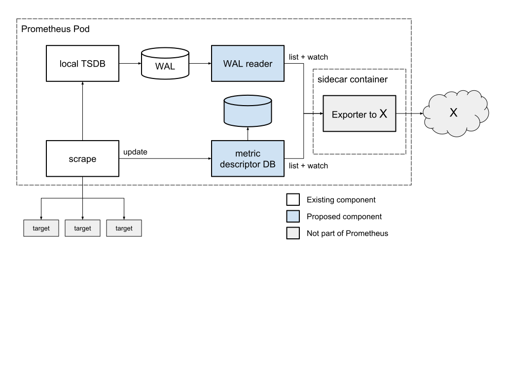

# Design

_Javier Kohen (jkohen), Fabian Reinartz (fabxc)_

_2018-04-05_

_Status: approved_

_Target Prometheus release: 2.4.0_

_Converted to Markdown from the [original design doc](https://docs.google.com/document/d/1TEqqE_Stq04drhjSU1I7Ctmuy0dpsvlPL1AKxqEQoSg/edit) (closed to prometheus-developers group and google.com domain)._

## Overview

The goal of this proposal is to enable ingestion of data passing through the Prometheus server into other monitoring solutions via supported API, with no code changes (that is, once the proposal is implemented).

The benefits over the Remote Storage API are:


*   Low-latency high-throughput access to sample stream in native WAL format. The Remote Storage implementation is reported to have high propagation delay.
*   Eventually with OpenMetrics we would get the reset/start timestamp for counters (required by our backend for accurate tracking of counter resets).
*   We can implement our own semantics for data durability. The current Remote Storage implementation drops data if the backend is down or cannot keep up with the load.
*   Atomic access to whole samples of composite data types (histogram and summary).
*   Access to client metadata on the metrics: type (gauge, counter, etc.), documentation, eventually unit and other OpenMetrics info. Some monitoring solutions require metadata at ingestion time; the metadata is available in the Prometheus client, but the Prometheus server doesn't propagate it beyond the scrape phase.

The high-level architecture of using a metric descriptor database and tracking the write-ahead log (WAL) was initially suggested by Brian Brazil, Fabian Reinartz, and Julius Volz.


## Requirements


*   Some monitoring APIs require type information for the metrics and its values before any sample is ingested. Let's call this a metric descriptor. Metric descriptors contain static information about the metric and its values, and are useful for validation, optimization, and presentation of the data. 
    *   [Roadmap item](https://prometheus.io/docs/introduction/roadmap/#server-side-metric-metadata-support) to make metadata available to the Prometheus server.
    *   metric descriptors: metric name, metric type (gauge, cumulative, histogram, etc.), metric description.
        *   In OpenMetrics (MetricDescriptor message): all the above, unit.
        *   As an extension point, the database could also store other OpenMetrics fields such as BucketOptions, EnumValue.value_set. In the meantime, the consumer needs to infer some of this from the TSDB samples.
    *   Metric descriptors should be stored at metric granularity.
        *   Compatible changes to the descriptor should be at least tolerated.
        *   Incompatible changes to the descriptor should be tolerated and may cause the TSDB data to be partially impossible to query for any query engine that enforces the descriptor type (not the case for Prometheus). This is an acceptable behavior.
        *   Although in the real world two clients may have a different metric descriptors for the same metric name, making Prometheus's data model richer in that way is not in the scope of this document. We accept that flip-flopping between these values is acceptable, with the outcome dictated by the previous bullets.
    *   The metric descriptor is a snapshot in time. Normally, descriptors are expected to remain compatible with archived data, and new revisions should introduce backward compatible changes (e.g. typo fixes in metric description). However, Prometheus doesn't prevent users from making incompatible changes to their metric descriptors, so the exporter needs to handle the change as best as it can. Incompatible changes should be a rare event, and the practical applications of keeping historical metric descriptors are limited, making its value low compared to the additional complexity it exposes to the user.
*   Some metric ingestion APIs need all buckets in a histogram samples to be written in one operation. This is because the histogram samples are atomic in those systems.
    *   The entire histogram should be in a single TSDB commit. The reader needs to process the entire commit as a unit and assemble multi-part values, such as histograms.
    *   This is true with Prometheus today, because the server adds all samples obtained from a given scrape to a single commit, plus a second commit for derived metrics such as "up".
*   Low-latency access to sample stream. Prometheus maintainers proposed reading the write-ahead log (WAL).
    *   Data shows up with low-latency since scrape.
    *   Timestamped (needed to implement counters as deltas without explicit reset timestamp).
    *   Each time series is time-ordered.
    *   Checkpoint-compatible. As a best-effort it will prevent sending duplicate data to the ingestion API. With the current Prometheus WAL we should be able to use the file name and position, as files are append-only.
*   Ability to join metric descriptors with samples.
    *   Eventual consistency as a goal. The initial implementation may be best-effort.
    *   Low-latency availability of new metric descriptors.
    *   Metric descriptors may show up in the DB after samples show up in the WAL.

Nice to have:


*   Complete set of target labels (from discovery).
    *   All service discovery metadata is available today via the [Targets API](https://prometheus.io/docs/prometheus/latest/querying/api/#targets).
        *   The data doesn't survive federation.
        *   The caller will have to heavily cache the results.
    *   Some providers have rigid schemas that enable data joins across multiple tools. Instead of asking users to preserve the right labels using the relabel feature in Prometheus, it would be nice to keep the original target labels to avoid manual configuration and reduce the chance of human error. This would also let users keep their existing metric layout in the Prometheus TSDB regardless of how the data is labeled in other providers.


## Design

The diagram below shows the proposed changes to the existing Prometheus architecture. We propose two new components: WAL Reader and Metric Descriptor DB. Details in the sections below.




### Metric descriptor DB (MDDB)

[API docs](https://github.com/prometheus/prometheus/blob/master/docs/querying/api.md#querying-target-metadata)


*   CRUD
    *   Low write latency to avoid impact on ingestion path.
    *   Low propagation delay to reduce misses for new metrics.
    *   In-memory database (as per [roadmap entry](https://prometheus.io/docs/introduction/roadmap/#server-side-metric-metadata-support)). Data may be incomplete until a full scrape cycle is completed.
*   Data has some persistence after the metric is no longer exposed.
    *   This ensures that a caller can get a metric descriptor for a short-lived metric if processing the WAL is delayed.
    *   A safe default for persistence would be the life of the WAL. With the expectation that there will be few short-lived metric descriptors, this isn't expected to add a significant overhead.
*   Key/value database.
    *   Key is the metric name.
    *   Value is compound message:
        *   MetricDescriptor message: metric type (gauge, cumulative, histogram, etc.), metric description.
        *   Must accept new fields whenever Prometheus adds new metadata.
        *   (optional and up for discussion) Point message. Used as a prototype to prepopulate fields such as BucketOptions and EnumValue.value_set, which are in OpenMetrics, but not part of the Prometheus data model.
*   Updates are deduplicated based on bitwise comparison of the stored value. No-op updates won't be propagated to watchers.
*   List + get operations allow cheap bulk load on startup and pointed requests as new metrics are encountered (e.g. as the WAL is processed).


### WAL reader

Implementation at https://github.com/prometheus/tsdb/tree/master/wal


*   Library support in tsdb provides API to read the WAL efficiently and with portable semantics.
    *   On open dumps the entire WAL (as per existing WAL Reader semantics), then follows up with an infinite stream of updates.
    *   Only support the time range covered by the WAL (i.e. not go back to compacted files). We agreed to consider the compacted storage out of scope for this design.
    *   We'll start a reference implementation outside the Prometheus codebase. We'll try to keep its dependencies low, so it can be easily shared later if there's demand.
*   In the fullness of time either expand to cover longer time horizon or design the exporters to read from compacted files.
*   WAL data is flushed to disk every 5 seconds (default config), and files are created every 256MB, which is likely to occur less frequently.
    *   As long as these defaults don't change much, it should work well with this design.
    *   The WAL is intended to hold ~2 hours of data ([fabxc's design](https://fabxc.org/tsdb/#compaction)), which should be enough for any reasonable downtime of the exporter due to upgrades and other manually-initiated changes.
*   Risks of file-based API:
    *   Reader may cause compaction to fail on Windows by keeping sequence files open when the compactor tries to remove them. One workaround is to add a flag to disable WAL deletion, and leave it to the sidecar to deal with. This precludes multiple sidecars, but it should be acceptable in the experimental phase.

The following section goes into further detail on the implementation concerns of the proposed solution:


## Background

The TSDB write ahead log (WAL) is not generic and was built for a single purpose. It provides two record types: "series" and "samples".

Series entries encode a list of series in the form of `<id><labels>`.

Sample entries contain a list of samples that reference their series by ID assigned in the series entry, i.e. `<id><timestamp><value>`.

An entry list always encapsulates one entire scrape, which allows readers of the WAL to apply updates atomically. This is in contrast to the current remote write API, which has ungrouped streams of samples, which may cause semantical issues on read, e.g. histogram buckets being out of sync.

Due to the inter-dependence of WAL records, it cannot be simply truncated at the front. Instead it has to rewrite all series that are still live into the first segment. This ensures that on subsequent replays, no samples relevant to the WAL's active time window have dangling references.

It unfortunately means that the WAL is not truly immutable.


## Problems


### Garbage Collection

Suppose the WAL is replicated to a receiver. To correctly map samples to series, the receiver must maintain a mapping from the WAL's series ID to the series descriptor or another ID in its own backend.

When just tailing the WAL, the receiver cannot reliably know about dropped series and its own mapping may grow forever.

**Potential solutions:**


*   Write additional WAL entries for dropping a series. Requires no re-sync but requires changes to the current WAL implementation. This may be asking for trouble via races.
*   Periodically discard all receiver/reader state and re-sync the WAL from the beginning. This means periodically re-transmitting quite a bit of data. Potentially samples before a certain WAL offset can be dropped to mitigate that. This seems to be a relatively safe solution.


### Metadata

It is not generally possible to have a Prometheus-wide store of metadata. Different targets may expose the same metric with slight drift (e.g. changed help text) or have the same name but are not referring to the same underlying metric (lack of namespaces).

There are different ways to handle those conflicts and it is left to the consumer. Thus the metadata API should scope metadata to targets.

The data model in the exposition is richer than Prometheus's internal and query-level model. There is no clear and clean way to add metadata to it. Thus the metadata will be provided per metric name without any mapping to underlying series at all. The consumer can restore such a mapping as required.

The instance label is meant to be a unique identifier for a target. Thus the API will base the lookup on it. An internal index from instance label to target needs to be implemented.

The resulting API is (with equivalent REST endpoint):

	`GetMetadata(instance, metric string) (type, help string, error)`

Mis-configuration may result in instance labels not being unique across targets. In those cases behavior is undefined. First/random-match will probably be applied in practice.

The metadata store always gets updated before series are written to TSDB. Thus consumers can generally rely on metadata being available as new series are written to the WAL.

However, since the metadata lifecycle is bound to the target internally, lookups may intermittently or permanently fail after a Prometheus restart. Similar situations may occur with long WAL consumer lags and/or very short target lifecycles.

This was deemed an acceptable trade-off for the time being.


### Memory Overhead

Retaining descriptions for all metrics  in memory may impose a significant overhead. Already today, the per-series overhead generally overshadows the actual sample data we hold for it.

The same descriptions and type strings will be repeated many times across targets. Unfortunately we have no easy and safe means to deduplicate strings in memory, mostly since we cannot really garbage collect them.

The impact of this has to be measured.


### WAL reading

A first reference implementation will be provided based on a sidecar that sends data to Stackdriver. This requires the WAL to be safe for concurrent out-of-process reads.

The first WAL segment currently gets rewritten during [truncation](https://github.com/prometheus/tsdb/blob/master/wal.go#L90) for reasons outlined above. It may still be safe since this happens atomically. However, the semantics are hard to reason about, especially when considering readers may try to re-open a segment and continue from a certain offset.

Secondly, file pre-allocation and flushing internals can lead to issues. The WAL also contains deletion records. We assume that consumers always discard them.

To address those concerns, we propose a rewrite of the WAL. A forward-compatible auto-migration will be provided.

**Records**

The record types and their encodings remain unchanged.

**Truncation**

Truncation drops sample data from the beginning of the WAL that's before a certain timestamp. However, it only truncates full segments and samples before the break point may remain. Series records are dropped if they do not appear in a provided list. The list is backed by the current in-memory state.

We retain those semantics but move towards a checkpoint procedure that writes a new file from a set of WAL segments.

If we checkpoint data from segment M to N, the resulting file is named `checkpoint.N`. After it was atomically written, readers should no longer open segments or checkpoints below N. Previous checkpoints and old segments can then be deleted.

A consumer should generally open all historic segments before starting to process them to avoid races. Generally, if segments disappear unexpectedly, the consumer should retry while looking for a more recent checkpoint file. Offsets like `<segment_num, file_offset>` for last processed data may be invalidated. The consumer should fall back to filtering samples based on a safe timestamp delta.

Checkpoint data is directly taken from the relevant segments. We could checkpoint the actual state of the head block and benefit from already compressed data. Reloading the data on restart would be much faster, too.

However, semantics would be much more complicated since we'd be checkpointing mutating data. At this point it's likely not worth it.

**Flushing**

The WAL's internal buffer is currently flushed as it fills up but is not aligned with records. Thus we may end up with torn writes, which is hard to handle and potentially impossible to detect.

The consumer could read with a "safe" delay, but this seems like a weak long-term strategy.

We should consider moving to [RocksDB's WAL format](https://github.com/facebook/rocksdb/wiki/Write-Ahead-Log-File-Format) for the listed benefits.

It should allow us to move to concurrent writes in the future without further format changes. This is a convenient benefit since the WAL is the single point of contention right now.

**Pre-allocation**

The current WAL uses pre-allocation, which may speed up writes a bit and avoids fragmentation of segments on disk. Under the new design we should re-evaluate how big the practical benefit is. In return external consumers may read invalid zero bytes that are indistinguishable from real data.

Due to the vertical layout (single samples for many series) we are likely not IO-bound during read-back in our use case.

**New API**

The WAL would be generalized to the following interface and specific record format is merely dictated by higher-level parts of TSDB.

Checkpointing is another independent procedure.


```
type WAL interface {
	// Queue record into the WAL and return immediately.
	//
	// XXX: Tentative/optional. It could be beneficial especially when
// we create millions of new series at once.
	LogAsync([]byte)

	// Queue record into the WAL and return once it was written to disk.
	// A single thread may call LogAsync multiple times followed by a
// single Log to ensure that all records were written successfully.
	Log([]byte) error

	// Drops all segment files below the given segment number.
	Truncate(segment int) error

	// Returns a reader over the given segment range.
	Reader(from, to int) WALReader
}

type WALReader interface {
	// Next returns the next record.
	Next() ([]byte, error)

	// Close all underlying resources.
	Close() error
}
```


Note that the interface does not generally provide an eternally tailing reader. Consumers should just poll for new segments. This makes our initial implementation simpler.
